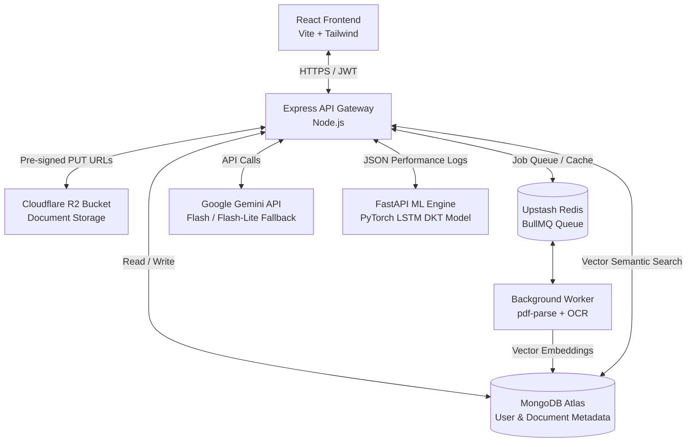

# StudyGenie: AI-Powered Adaptive Learning Ecosystem

StudyGenie is an advanced, high-performance learning platform that combines modern backend design, local document intelligence (RAG & OCR), and deep learning sequence models to provide students with personalized, adaptive study paths. 

Rather than a simple static frontend assistant, StudyGenie is engineered around a secure Node.js/Express API, cloud object storage, and a Python-based PyTorch Deep Knowledge Tracing (DKT) engine.

---

## Technical Architecture Blueprint



---

## Core Capabilities

### 1. Document Intelligence & Local Vector Search (RAG)
*   **Vector Search RAG**: Documents are parsed, split into semantic chunks, and embedded using Google's `text-embedding-004` model. Vector similarity lookups are performed natively in MongoDB Atlas using cosine similarity indices to feed highly relevant context to the tutor model.
*   **Server-Side OCR Workers**: Background workers handle PDF text extraction and OCR (Optical Character Recognition) asynchronously, offloading CPU-heavy parsing from the user's browser tab.

### 2. Predictive Mastery Modeling (Deep Knowledge Tracing)
*   **PyTorch LSTM Engine**: The platform features a Deep Knowledge Tracing (DKT) LSTM model implemented in PyTorch. The model tracks a student's historical sequence of quiz attempts, normalized answer times, attempt counts, and hint usage to forecast their current conceptual mastery.
*   **Adaptive Roadmaps**: Based on the LSTM's mastery forecast, the platform dynamically generates tailored study roadmaps, offering Easy/Fundamental, Medium/Practice, or Hard/Challenge paths.

### 3. Enterprise-Grade Security & Performance
*   **Secure API Routing**: All large language model queries are proxied through a secure Express.js backend. This isolates Google Gemini API keys entirely from the browser, protecting developer credentials.
*   **Presigned Upload Streams**: File uploads are streamed directly from the client to a Cloudflare R2 bucket using temporary pre-signed PUT URLs, keeping file sizes off the application server.

---

## Tech Stack

*   **Frontend**: React 19 (Vite), Tailwind CSS, Framer Motion, Axios, React Router.
*   **API Gateway**: Node.js, Express, JSON Web Tokens (JWT), Mongoose, `@google/generative-ai`.
*   **Databases**: MongoDB Atlas (App Data & Vector Store), Upstash Redis (Caching & Task Queue).
*   **Cloud Hosting**: Cloudflare R2 (S3-Compatible Object Storage).
*   **ML API Server**: Python, FastAPI, PyTorch (LSTM), NumPy.


## Quickstart

### 1. Configure Environment Variables
Create a `.env` file in the project root folder:
```env
# Frontend (Client)
VITE_FIREBASE_API_KEY=your_firebase_key
VITE_API_URL=http://localhost:5000/api

# Backend (Server)
PORT=5000
MONGODB_URI=your_mongodb_connection_string
JWT_SECRET=your_jwt_signing_key
GEMINI_API_KEY=your_google_gemini_key
```

### 2. Launch Services
Start the Node.js Express server:
```bash
cd backend
npm install
npm run dev
```

Start the Vite React frontend:
```bash
npm install
npm run dev
```